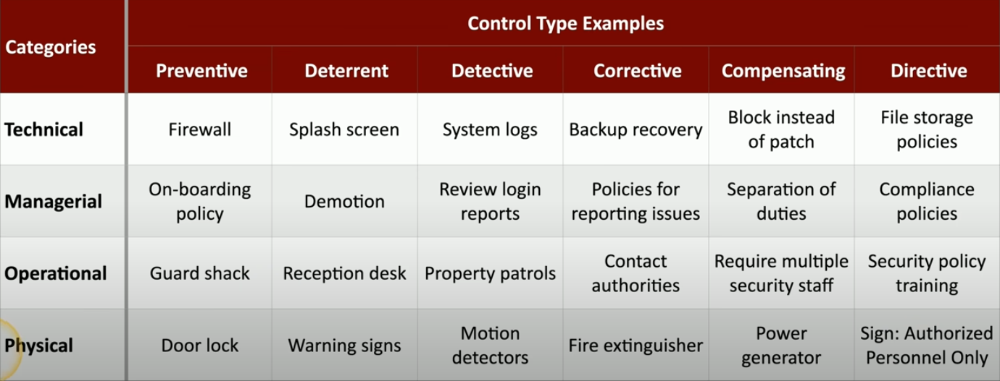

# Security+ SY0-701 — Control Type Examples

## 🧩 Tipos de Controles

- **Preventive:** Evita que um incidente aconteça.
- **Deterrent:** Desencoraja a ação maliciosa.
- **Detective:** Detecta que um incidente ocorreu.
- **Corrective:** Corrige os efeitos de um incidente.
- **Compensating:** Substitui um controle primário ausente.
- **Directive:** Define regras, políticas ou orientações.

---

## 🧪 CATEGORIA: Technical

| Tipo         | Exemplo              | Explicação                                               |
|--------------|----------------------|-----------------------------------------------------------|
| Preventive   | Firewall             | Impede tráfego não autorizado.                           |
| Deterrent    | Splash screen        | Avisos legais que desestimulam uso indevido.             |
| Detective    | System logs          | Registra eventos para auditoria.                         |
| Corrective   | Backup recovery      | Recupera dados após falha ou ataque.                     |
| Compensating | Block instead of patch | Bloqueia acesso a serviço vulnerável enquanto não há patch. |
| Directive    | File storage policies | Define regras sobre onde e como armazenar arquivos.       |

---

## 🧑‍💼 CATEGORIA: Managerial

| Tipo         | Exemplo              | Explicação                                               |
|--------------|----------------------|-----------------------------------------------------------|
| Preventive   | On-boarding policy   | Garante que novos funcionários entendam suas responsabilidades. |
| Deterrent    | Demotion             | Redução de cargo como penalidade, desincentiva más ações. |
| Detective    | Review login reports | Verifica acessos suspeitos.                              |
| Corrective   | Policies for reporting issues | Normas para relatar problemas e tratá-los.       |
| Compensating | Separation of duties | Divide tarefas críticas entre diferentes pessoas.         |
| Directive    | Compliance policies  | Define obrigações legais e regulatórias.                 |

---

## 🛡️ CATEGORIA: Operational

| Tipo         | Exemplo              | Explicação                                               |
|--------------|----------------------|-----------------------------------------------------------|
| Preventive   | Guard shack          | Impede entrada física não autorizada.                    |
| Deterrent    | Reception desk       | A presença desencoraja visitantes não autorizados.       |
| Detective    | Property patrols     | Segurança patrimonial detecta ações suspeitas.           |
| Corrective   | Contact authorities  | Chama reforços ou polícia após incidente.                |
| Compensating | Require multiple security staff | Substitui falta de controle automatizado.         |
| Directive    | Security policy training | Treina funcionários sobre como agir com segurança. |

---

## 🧱 CATEGORIA: Physical

| Tipo         | Exemplo              | Explicação                                               |
|--------------|----------------------|-----------------------------------------------------------|
| Preventive   | Door lock            | Bloqueia fisicamente o acesso.                           |
| Deterrent    | Warning signs        | Avisa sobre consequências de entrar sem permissão.       |
| Detective    | Motion detectors     | Detecta movimento não autorizado.                        |
| Corrective   | Fire extinguisher    | Corrige um incidente de incêndio.                        |
| Compensating | Power generator      | Substitui falha de energia.                              |
| Directive    | Sign: Authorized Personnel Only | Indica regras de acesso a uma área restrita.       |

---

## 📝 Dica para a prova:

- Memorize **pelo menos um exemplo por categoria**.
- Entenda a **diferença entre tipos de controle**, especialmente entre **preventive**, **detective** e **corrective**.
